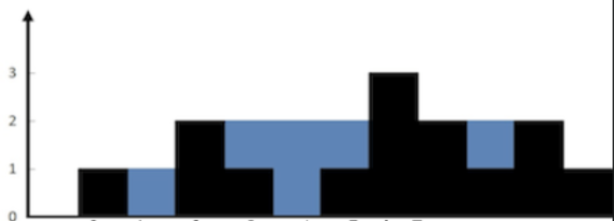

# Trapping Rain Water
Given n non-negative integers representing an elevation map where the width of each bar is 1, compute how much water it can trap after raining.
```
Example 1:
Input: height = [0,1,0,2,1,0,1,3,2,1,2,1]
Output: 6
Explanation: The above elevation map (black section) is represented by array [0,1,0,2,1,0,1,3,2,1,2,1]. In this case, 6 units of rain water (blue section) are being trapped.
```


```
Example 2:
Input: height = [4,2,0,3,2,5]
Output: 9
```
 
```
Constraints:
n == height.length
0 <= n <= 3 * 104
0 <= height[i] <= 105
```


# Two pointer solution
- Complexity: O(n) as we only iterate through each numberi n the height list once.
- Space complexity: O(1) since we use 2 pointers regardless of the size of height list.
- The key to solving this is to recognize that the water is bounded by two sides. The smaller side is what decides how much water can be bounded. 
- What we do in this solution is keep track of which side has the highest bound and then we keep an eye on the other side since it will decide how much water we can store. Of course at each step the amount of blocks present will also take up space thus we take the height of the lower bound and subtract it by the height of the current block.
```js
function trap (height) {
  let result = 0, leftMax= 0, rightMax = 0, l = 0, r = height.length - 1;

  while (l < r){
    if (height[l] < height[r]) {
      if (height[l] >= leftMax) leftMax = height[l];
      else result += leftMax - height[l];
      l++;
    } else {
      if (height[r] >= rightMax) rightMax = height[r];
      else result += rightMax - height[r];
      r--;
    }
  }
  
  return result;
};

```
